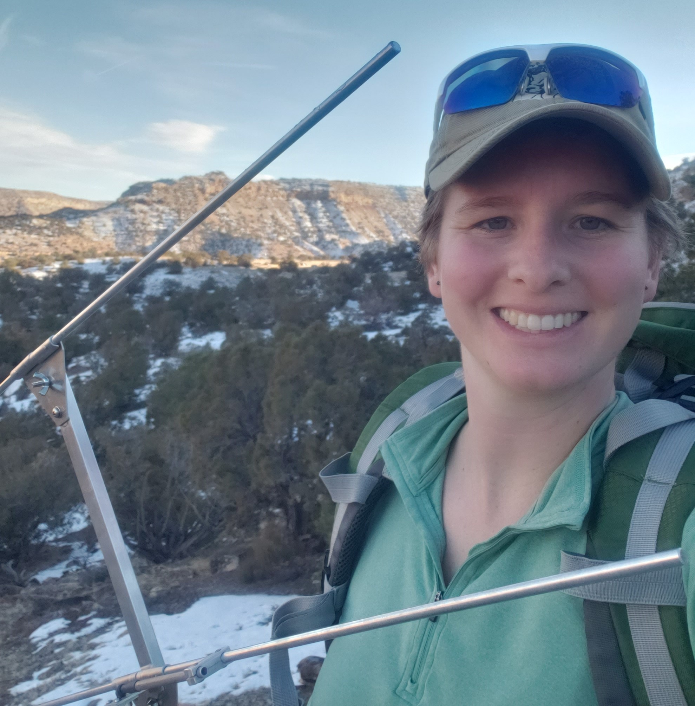

I am an MS student in Fish, Wildlife, and Conservation Ecology at New Mexico State University, advised by Dr. James Cain.  My interests lie in large mammal ecology, human-wildlife interactions, and wildlife management.

### Hello! 

My name is Ashley Evans.  I received Bachelor of Science degrees in both Fish and Wildlife Science and Natural Resource Sustainability Studies from Paul Smith’s College in 2016.  Throughout the course of my studies, I gained field experience in the classroom and through technician positions on various projects.  I conducted experimental trials to examine behavioral thermoregulation of spiny mountain lizards in New Mexico, collected genetic samples from black bears in Louisiana, raised orphaned mantled howler monkeys in Panama, and banded raptors in the Adirondack Mountains.  My senior capstone project was a management plan for the reintroduction of wolverine into Colorado.  I also left plenty of time for fun as I competed on the cross country, snowshoe racing, Nordic skiing, and marathon canoe racing teams at Paul Smith’s.

After graduating summa cum laude, I moved to Bishop, California where I worked on the desert bighorn management program for California Department of Fish and Wildlife.  This is where I first experienced the complexity of state-level wildlife management and came to appreciate the collaboration, knowledge, and research required to make informed and effective management decisions.  I was involved in some phenomenal monitoring and management actions including flying helicopter surveys over desert ranges, monitoring water sources in sweltering Mojave summer temperatures, assisting with mule deer and desert bighorn captures, and checking out hunter-harvested rams.  I was exposed to the extreme temperatures and unforgiving but spectacular landscapes of the Mojave Desert where I was in awe of the adaptations that make life possible in such a harsh environment.  I gained invaluable experience during my time with CDFW and made lifelong friends and lasting memories, but after four years, I wanted to be more involved in the research, management, and decision making of wildlife biology.  For me, the logical next step was graduate school.

I was accepted into Dr. James Cain’s lab at New Mexico State University in Fall 2020.  I was taken on as the sole graduate student for a rigorous research project into the influence of human recreation on desert bighorn in the Dominguez-Escalante National Conservation area, located in western Colorado.  The objectives of my thesis research are to determine how recreation influences desert bighorn behavior, stress hormones, movements, and habitat selection.  I have spent thousands of hours behind my spotting scope over the last two years, observing desert bighorn behavior in dramatic and beautiful canyon landscapes and loving [nearly] every minute of it.  Now that my data collection has concluded, I am now focused on analyzing the staggering amounts of data that my technicians and I have collected.  I am excited that my close collaboration with Bureau of Land Management and Colorado Parks and Wildlife means that the results of my thesis will be used to inform management of the land, wildlife, and people of not only my study area, but also landscapes beyond my reach.  That is the goal of my career; to contribute to the informed management of our invaluable wildlife populations, the complex ecosystems that support them, and the people who need to coexist with it all.

